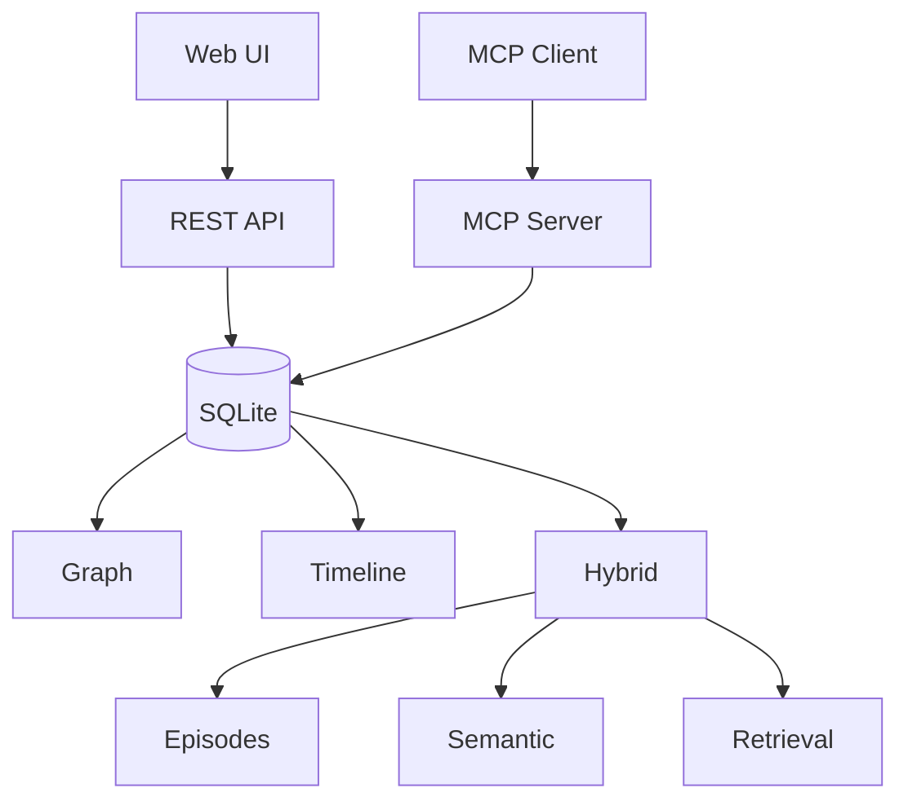

# memorantado

Persistent local memory for AI agents via [Model Context Protocol (MCP)](https://modelcontextprotocol.io/). memorantado stores durable context in SQLite with a knowledge graph, append-only timeline, and hybrid episodic/semantic memory layer, plus a Svelte web UI for inspection and retrieval debugging.

## Features

- **Knowledge Graph**: Entities with typed relationships and observations.
- **Memory Timeline**: Append-only memory items with kind, title, tags, source, and content.
- **Hybrid Memory**: Raw episodes, semantic memories, evidence, bitemporal claim history, lifecycle controls, and conflict audit.
- **Hybrid Retrieval**: FTS5 BM25, lexical overlap, local or opt-in Ollama embeddings, temporal filters, priors, and Reciprocal Rank Fusion.
- **Evaluation**: Deterministic mutation benchmark with Recall, precision, F1, MRR, nDCG, temporal accuracy, stale leakage, and latency percentiles.
- **Obsidian Wiki**: Deterministic one-way Markdown projection with stable IDs, history, evidence, conflicts, timeline pages, manifest, and Bases table.
- **Interoperability**: Versioned JSONL export/import and read-only MCP resources for memories and episodes.
- **Multi-Project**: Isolated namespaces via `project` parameters or `MEMORANTADO_PROJECT`.
- **Web Dashboard**: Svelte 5 UI for search, graph browsing, lifecycle review, retrieval debugging, conflicts, and benchmarks.
- **Local-Only Security**: Binds to `127.0.0.1` with host and origin validation; remote Ollama embedding endpoints are rejected.
- **Agent-Ready Tooling**: MCP, REST API, OpenAPI generation, validation scripts, CI, and benchmark scripts.

## Installation

### From npm (recommended)

```bash
npm install -g memorantado
memorantado
```

Run the MCP stdio server directly:

```bash
memorantado --stdio
```

Or run without a global install:

```bash
npx memorantado
npx memorantado --stdio
```

### From source

```bash
git clone https://github.com/alfredosdpiii/memorantado.git
cd memorantado
npm install
npm run build
npm start
```

HTTP mode serves the dashboard and API at `http://127.0.0.1:3789`.

## MCP Configuration

### Stdio (recommended)

Use stdio for local agents because it does not require a long-running HTTP process.

```json
{
  "mcpServers": {
    "memorantado": {
      "type": "stdio",
      "command": "memorantado",
      "args": ["--stdio"],
      "disabled": false,
      "timeoutMs": 300000
    }
  }
}
```

For project-specific memory, set `MEMORANTADO_PROJECT`:

```json
{
  "mcpServers": {
    "memorantado": {
      "type": "stdio",
      "command": "memorantado",
      "args": ["--stdio"],
      "env": {
        "MEMORANTADO_PROJECT": "my-project"
      }
    }
  }
}
```

If you prefer `npx`:

```json
{
  "mcpServers": {
    "memorantado": {
      "type": "stdio",
      "command": "npx",
      "args": ["memorantado", "--stdio"]
    }
  }
}
```

### HTTP

Start the local HTTP server:

```bash
memorantado
```

Then configure an HTTP MCP client:

```json
{
  "mcpServers": {
    "memorantado": {
      "type": "http",
      "url": "http://localhost:3789/mcp"
    }
  }
}
```

For project-specific memory via HTTP:

```json
{
  "mcpServers": {
    "memorantado": {
      "type": "http",
      "url": "http://localhost:3789/mcp?project=my-project"
    }
  }
}
```

## Recommended Agent Usage

1. Call `retrieve_memory_context` at the start of non-trivial work.
2. Save durable preferences, decisions, procedures, and project facts with `append_episode` using extraction enabled.
3. Use `upsert_semantic_memory` for explicit facts that should be reinforced or conflict-checked.
4. Use `explain_semantic_memory` when provenance matters.
5. Never store secrets, credentials, API keys, private tokens, or sensitive personal data.

## Architecture



```text
                    +------------------+
                    |   MCP Clients    |
                    | Droid, Pi, etc.  |
                    +--------+---------+
                             |
                             v
+---------------------------+---------------------------+
|                     Fastify Server                    |
|                   http://127.0.0.1:3789               |
+-------+-------------------+-------------------+-------+
        |                   |                   |
        v                   v                   v
   /mcp (MCP)         /api/* (REST)        /* (Static)
        |                   |                   |
        v                   v                   v
+-------+-------------------+-------+   +---------------+
|           SQLite Database         |   |   Svelte UI   |
| - graph entities and relations    |   | - Search      |
| - timeline memory items           |   | - Graph       |
| - episodes and semantic memories  |   | - Memory      |
| - provenance and conflicts        |   | - Hybrid      |
| - FTS5 and local embeddings       |   | - Inspector   |
+-----------------------------------+   +---------------+
```

### Data Model

**Knowledge Graph** stores structured entity-relationship data.

| Table          | Purpose                                                          |
| -------------- | ---------------------------------------------------------------- |
| `entities`     | Named nodes with type, such as `person`, `project`, or `concept` |
| `observations` | Facts attached to entities                                       |
| `relations`    | Typed edges between entities                                     |

**Memory Timeline** stores append-only records.

| Table          | Purpose                                                         |
| -------------- | --------------------------------------------------------------- |
| `memory_items` | Timestamped records with kind, title, content, tags, and source |

**Hybrid Memory** stores raw events, extracted facts, retrieval metadata, and provenance.

| Table                | Purpose                                                  |
| -------------------- | -------------------------------------------------------- |
| `episodes`           | Raw conversation or event records                        |
| `semantic_memories`  | Extracted or explicitly upserted facts and preferences   |
| `memory_sources`     | Links semantic memories back to source episodes          |
| `memory_conflicts`   | Open, resolved, or ignored memory conflicts              |
| `entity_aliases`     | Canonical names and aliases for future entity resolution |
| `memory_embeddings`  | Local embedding vectors for semantic memories            |
| `episode_embeddings` | Local embedding vectors for episodes                     |
| `memory_access_log`  | Retrieval queries, selected result IDs, and latency      |
| `benchmark_runs`     | Local benchmark reports and metrics                      |

All memory layers use SQLite and FTS5. Hybrid retrieval combines FTS, deterministic local embeddings, lexical overlap, recency, importance, and confidence.

## MCP Tools

All tools accept an optional `project` parameter for namespace isolation. Defaults to `global`.

### Knowledge Graph

| Tool                  | Description                                               |
| --------------------- | --------------------------------------------------------- |
| `create_entities`     | Create entities with type and initial observations        |
| `create_relations`    | Create typed relationships between entities               |
| `add_observations`    | Append observations to existing entities                  |
| `delete_entities`     | Remove entities and cascade-delete relations/observations |
| `delete_observations` | Remove specific observations from entities                |
| `delete_relations`    | Remove relationships                                      |
| `read_graph`          | Retrieve entire graph                                     |
| `search_nodes`        | Full-text search across entities and observations         |
| `open_nodes`          | Retrieve specific entities by name                        |

### Memory Timeline

| Tool                  | Description                                                        |
| --------------------- | ------------------------------------------------------------------ |
| `append_memory_item`  | Add timestamped memory with kind, title, content, tags, and source |
| `search_memory_items` | Full-text search with optional kind filter                         |
| `get_memory_item`     | Retrieve a single memory item by ID                                |
| `delete_memory_item`  | Remove a memory item by ID                                         |

### Hybrid Memory

| Tool                       | Description                                                   |
| -------------------------- | ------------------------------------------------------------- |
| `append_episode`           | Append a raw episode and optionally extract semantic memories |
| `extract_episode_memories` | Run local extraction for an existing episode                  |
| `retrieve_memory_context`  | Return a ranked context pack for a query                      |
| `list_episodes`            | List raw episodes                                             |
| `list_semantic_memories`   | List semantic memories by status                              |
| `upsert_semantic_memory`   | Create, reinforce, or conflict-check a semantic memory        |
| `explain_semantic_memory`  | Return a semantic memory with source episodes and conflicts   |
| `list_memory_conflicts`    | List open, resolved, or ignored conflicts                     |
| `resolve_memory_conflict`  | Mark a conflict resolved or ignored                           |
| `run_memory_benchmark`     | Run the local synthetic fixture benchmark                     |

### Example Tool Parameters

#### append_episode

```typescript
{
  project?: string,
  session?: string,
  actor?: string,
  role?: string,
  content: string,
  source?: string,
  metadata?: Record<string, unknown>,
  extract?: boolean
}
```

Extraction is intentionally conservative: completion reports, validation chatter, and other operational status sentences are not promoted to durable semantic memories.

#### retrieve_memory_context

```typescript
{
  project?: string,
  query: string,
  limit?: number,
  tokenBudget?: number,
  mode?: "current" | "as_of" | "history" | "all",
  asOf?: string,
  recordedAt?: string
}
```

Use `set_memory_lifecycle` to archive or restore a memory without deleting its evidence or claim history.

#### upsert_semantic_memory

```typescript
{
  project?: string,
  scope?: "user" | "agent" | "session" | "project" | "global",
  kind?: string,
  subject: string,
  predicate?: string,
  object?: string,
  content: string,
  confidence?: number,
  importance?: number,
  sourceEpisodeId?: number,
  metadata?: Record<string, unknown>
}
```

## CLI Operations

```bash
memorantado --help
memorantado --version
memorantado export-jsonl <PROJECT> > memories.jsonl
memorantado import-jsonl <EMPTY_PROJECT> memories.jsonl
memorantado wiki <PROJECT> [VAULT_ROOT]
memorantado backfill-embeddings <PROJECT>
```

`wiki` defaults to `~/Documents/wiki` and atomically rebuilds its `Memorantado Generated` folder. SQLite remains canonical; generated Markdown is disposable and is never re-imported.

The MCP server also exposes read-only resources at `memory://<PROJECT>/memories/<ID>` and `memory://<PROJECT>/episodes/<ID>`.

## Web UI

Access at `http://127.0.0.1:3789` after starting the server.

| Route                         | Description                                                                                |
| ----------------------------- | ------------------------------------------------------------------------------------------ |
| **Search** (`#/`)             | Global search across graph and timeline memory                                             |
| **Graph** (`#/graph`)         | Visual graph of entities and relationships                                                 |
| **Entity** (`#/entity/:name`) | Detail view with observations and relations                                                |
| **Memory** (`#/memory`)       | Browse and search memory timeline                                                          |
| **Hybrid** (`#/hybrid`)       | Append episodes, inspect semantic memories, conflicts, retrieval packs, and benchmark runs |

Project selector in the navbar persists to `localStorage`.

## REST API

For web UI and programmatic access:

| Endpoint                                  | Method | Description                                 |
| ----------------------------------------- | ------ | ------------------------------------------- |
| `/api/health`                             | GET    | Health check                                |
| `/api/metrics`                            | GET    | Prometheus-style metrics                    |
| `/api/projects`                           | GET    | List all projects                           |
| `/api/search?q=&project=`                 | GET    | Unified search                              |
| `/api/graph?project=`                     | GET    | Full graph data                             |
| `/api/entity/:name?project=`              | GET    | Single entity detail                        |
| `/api/entity`                             | POST   | Create entity                               |
| `/api/entity/:name/observations`          | POST   | Add observation                             |
| `/api/observation/:id`                    | DELETE | Remove observation                          |
| `/api/relation`                           | POST   | Create relation                             |
| `/api/relation/:id`                       | DELETE | Remove relation                             |
| `/api/memory-items?project=&q=&kind=`     | GET    | List or search timeline memory              |
| `/api/memory-items`                       | POST   | Create timeline memory item                 |
| `/api/memory-items/:id?project=`          | GET    | Get memory item                             |
| `/api/memory-items/:id?project=`          | DELETE | Delete memory item                          |
| `/api/episodes?project=`                  | GET    | List raw episodes                           |
| `/api/episodes`                           | POST   | Append episode, optionally extract memories |
| `/api/episodes/:id?project=`              | GET    | Get episode                                 |
| `/api/episodes/:id/extract`               | POST   | Extract semantic memories                   |
| `/api/semantic-memories?project=&status=` | GET    | List semantic memories                      |
| `/api/semantic-memories`                  | POST   | Upsert semantic memory                      |
| `/api/semantic-memories/:id/explain`      | GET    | Explain memory provenance                   |
| `/api/retrieve-context`                   | POST   | Retrieve ranked context pack                |
| `/api/memory-conflicts?project=&status=`  | GET    | List memory conflicts                       |
| `/api/memory-conflicts/:id/resolve`       | POST   | Resolve or ignore conflict                  |
| `/api/memory-benchmark`                   | POST   | Run local synthetic benchmark               |

Generated OpenAPI output is available in `docs/openapi.json` and can be refreshed with `npm run docs:openapi`.

## Benchmarks

### Local synthetic fixture

`npm run bench:memory` runs a small deterministic fixture benchmark against a local SQLite database.

Current synthetic score:

| Benchmark      | Cases | Accuracy |
| -------------- | ----- | -------- |
| `bench:memory` | 2/2   | 100%     |

This benchmark checks that local ingestion, extraction, retrieval, and benchmark persistence work together. It is intentionally small and synthetic.

### Public memory benchmark harness

`npm run bench:public-memory` runs a local retrieval/evidence proxy harness over public datasets such as LoCoMo, LongMemEval, DMR-style MSC Self-Instruct, and AMA-Bench.

Important caveat: this script is not an official product benchmark run and must not be cited as an apples-to-apples comparison against systems that use LLM answer generation and LLM judges. Use it for local regression checks of retrieval coverage only.

## Configuration

| Environment Variable                  | Default                             | Description                           |
| ------------------------------------- | ----------------------------------- | ------------------------------------- |
| `MEMORANTADO_PORT`                    | `3789`                              | Server port                           |
| `MEMORANTADO_DB`                      | `~/.memorantado/memorantado.sqlite` | Database file path                    |
| `MEMORANTADO_PROJECT`                 | `global`                            | Default MCP project namespace         |
| `MEMORANTADO_ENABLE_METRICS`          | `true`                              | Enable `/api/metrics`                 |
| `MEMORANTADO_EMBEDDING_PROVIDER`      | `local-hash`                        | `local-hash` or opt-in `ollama`       |
| `MEMORANTADO_OLLAMA_URL`              | `http://127.0.0.1:11434`            | Loopback-only Ollama endpoint         |
| `MEMORANTADO_OLLAMA_EMBED_MODEL`      | `embeddinggemma`                    | Ollama embedding model                |
| `MEMORANTADO_OLLAMA_EMBED_DIMENSIONS` | model default                       | Optional positive embedding dimension |
| `LOG_LEVEL`                           | `info`                              | Fastify/Pino log level                |

After changing the embedding provider, model, or dimensions, run `memorantado backfill-embeddings <PROJECT>`.

## Development

```bash
# Watch mode with hot reload
npm run dev

# Web UI only, proxies API
npm run dev:web

# Type check without build
npm run typecheck

# Run tests
npm run test

# Run coverage
npm run test:coverage

# Run local synthetic benchmark
npm run bench:memory

# Run public retrieval/evidence proxy benchmark
npm run bench:public-memory

# Run all validation gates
npm run validate

# Full build
npm run build
```

### Project Structure

```text
src/
  main.ts              # Fastify server entry point
  security.ts          # Loopback + host/origin validation
  featureFlags.ts      # Environment-backed feature flags
  observability.ts     # Request IDs and Prometheus-style metrics
  api/routes.ts        # REST endpoints for web UI
  bench/               # Local and public retrieval benchmark scripts
  memory/              # Hybrid memory types, extraction, and local embeddings
  mcp/
    server.ts          # MCP tool definitions (Zod schemas)
    http.ts            # StreamableHTTPServerTransport
    project.ts         # Project name resolution
    eventStore.ts      # SSE event management
  db/
    db.ts              # SQLite connection
    migrate.ts         # Schema migration
    schema.sql         # DDL + FTS5 + triggers
    graph.ts           # Knowledge graph operations
    timeline.ts        # Memory timeline operations
    hybridMemory.ts    # Hybrid memory write/list/conflict/benchmark service
    hybridRetrieval.ts # Hybrid retrieval and context rendering
    hybridRows.ts      # Row mapping and scoring helpers

web/
  src/
    App.svelte         # Router + project selector
    lib/api.ts         # API client
    routes/            # Search, Graph, Entity, Memory, Hybrid pages
```

## Security

- **Loopback only**: Server binds to `127.0.0.1` and rejects non-loopback connections.
- **Host validation**: Checks `Host` header against allowed values.
- **Origin validation**: API routes validate `Origin` header, and MCP rejects browser origins.
- **No external network exposure**: Designed for local-only operation.
- **No secret memory**: Do not store secrets, credentials, tokens, API keys, or sensitive personal data.

## Requirements

- Node.js >= 20.0.0
- SQLite3, bundled through `better-sqlite3`

## License

MIT
